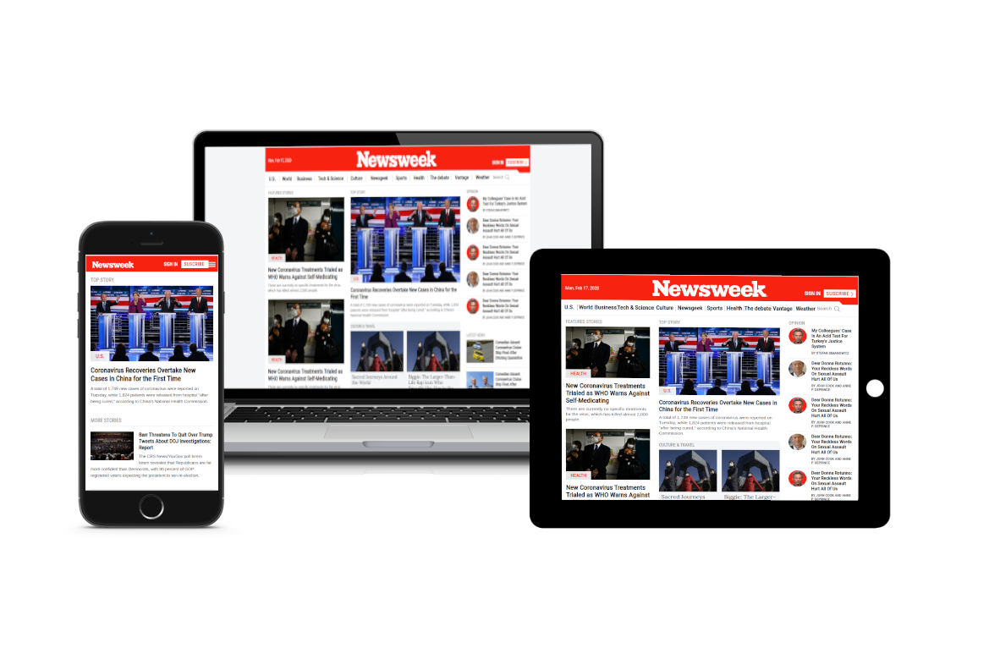

<p align="center">
    
</p>

<p align="center">
    <h1 align="center"> NewsWeek Clone</h1>    
</p>

<p align="center">
    <h2 align="center"> Building a full clone of Newsweek website with bootstrap</h2>    
</p>


<p align="center">
    <a href="https://img.shields.io/badge/Microverse-blueviolet" alt="Contributors">
        </a>
    <a href="https://developer.mozilla.org/es/docs/HTML/HTML5" alt="HTML">
        </a>
    <a href="https://www.w3schools.com/css/" alt="CSS">
        </a>
    <a href="https://www.w3schools.com/css/css3_flexbox.asp" alt="FlexBox">
        </a>
    <a href="https://www.w3schools.com/html/html_responsive.asp" alt="Responsive">
        </a>
    <a href="https://fontawesome.com/" alt="FontAwesome">
        </a>
    <a href="https://getbootstrap.com/" alt="Bootstrap">
        </a>
</p>

  <p align="center">    
    <br />
    <a href="https://github.com/rubenpazch/Newsweek-com-Bootstrap-"><strong>Explore this project »</strong></a>
    <br />
    <br />&#10023;
    <a href="https://happy-stonebraker-bc9837.netlify.app/">View Demo</a>   &#10023;  
    <a href="https://github.com/rubenpazch/Newsweek-com-Bootstrap-/issues">Report Bug</a>    &#10023;
    <a href="#Getting-Started">Getting Started</a> &#10023; <a href="#Install">Installing</a> &#10023;        
    <a href="#Whats-is-included-on-this-project">Whats is included on this project</a> &#10023;      
    <a href="#Authors">Author</a> &#10023;
     
     
  </p>


<br/>


Newsweek.com is a news website for this project I did clone the full website using HTML, CSS, and Bootstrap, the website has many sections like feature stories, opinion, more histories, culture and travel, top stories, ads section,  latest news, in the magazine, tech & science, footer, all this section have a specific behavior depending on the device. This is a responsive site ready to use in Mobile, Laptop, or Tablet. Finally, I have to mention that to build this project it was used the best programming practices relative to front end development. 

<br/>


<br/>


## Getting Started

This project was built using HTML, CSS, Bootstrap, Flexbox, Javascript, it is a web application and for running on your local environment you should follow these guidelines.


### Prerequisites

- FontAwesome

### Built With

Concepts used on this project

- HTML
- CSS
- Bootstrap
- Javascript
- Font-awesome


### Setup

The project repository can be found in [GitHub link](https://github.com/rubenpazch/Newsweek-com-Bootstrap-) or just clone the project using this command. 


```
Using SSH 

# git clone  git@github.com:rubenpazch/Newsweek-com-Bootstrap-.git

Using HTTPS

# git clone  https://github.com/rubenpazch/Newsweek-com-Bootstrap-.git

```

+ Open terminal on your workspace with

```
cd /home/workspace/Newsweek-com-Bootstrap-
```


## Install


To get started with the app, clone the repo, and to change the css style file located on css folder


### Usage

To watch the local version of this project check on your browser the  index file


### Tools used on this project

- Stickler CI
- Visual Studio Code
- CSS Formatter
- Stylelint


## Whats is included on this project

This project includes the next parts:

+ The home page
  + Navigation bar
  + Menu
  + Featured stories
  + Top stories
  + Opinion
  + Culture and Travel
  + Latest News
  + Ads section
  + MOre stories
  + Magazine
  + Featured slideshows
  + Suscribe
  + Footer


### Link to assignment

the assignment can be found  [here](https://www.theodinproject.com/courses/html5-and-css3/lessons/using-bootstrap).


## Authors

👤 **Ruben Paz Chuspe**


- Github: [@rubenpazch](https://github.com/rubenpazch)
- Linkedin: [rubenpch](https://www.linkedin.com/in/rubenpch/)
- Twitter: [rubenpch](https://www.linkedin.com/in/rubenpch/)


## 🤝 Contributing

Contributions, issues and feature requests are welcome!

Feel free to check the [issues page](issues/).

## Show your support

Give a ⭐️ if you like this project!

## Acknowledgments

- The Odin Project   
- Newsweeks.com

## 📝 License

This project is [MIT](lic.url) licensed.
